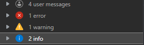
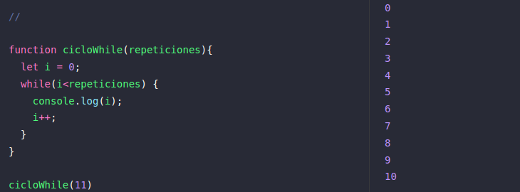
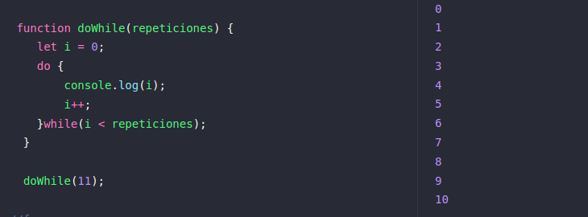
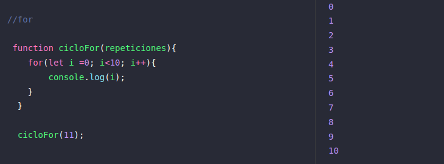
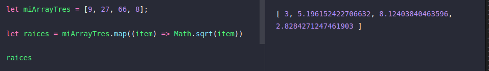
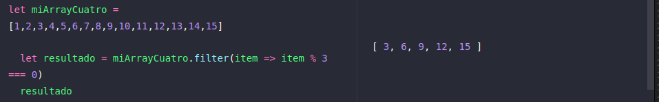
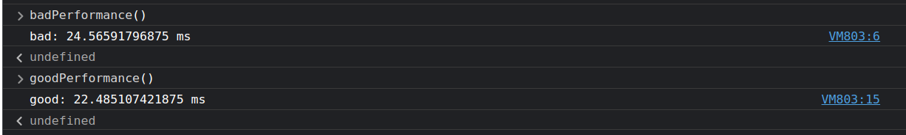
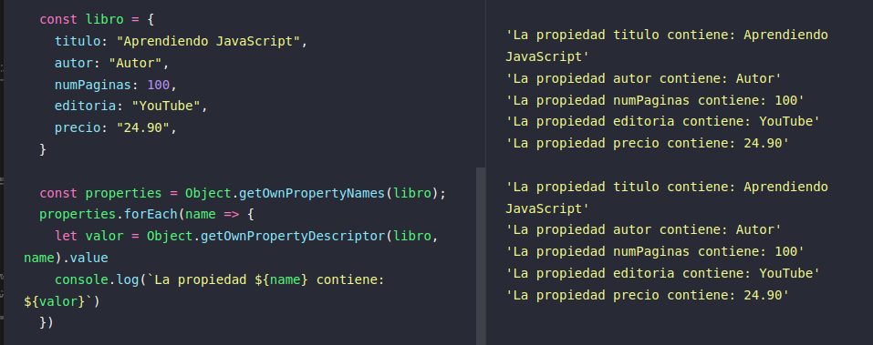
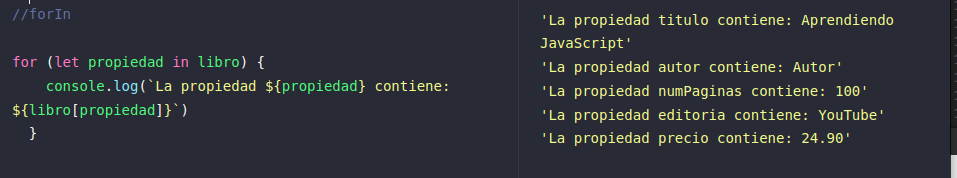

# JavaScript

	* No permite lectura ni escritura del lado del servidor, porque es un lenguaje del lado del cliente
	* No puede ser utilizado para aplicaciones de red por si solo
	* No tiene capacidad multihilo o múltiples procesos simultáneos
	* Todo en JavaScript es un objeto

## console.log
```js
console.log();
console.warn();
console.error();
console.info;
```




## Salida de cadenas y datos

```js
console.log(`Salida de datos (cadenas):  
            Dato Curiso  
            A toturial introduction to the programming language B  
            Por el autor Brian Kernigham  
            Fue donde se introdujo la oracion Hello Word, para ejemplificar la  
            salida de datos\n\n`)
```

Para la salida de datos tipo cade usamos " ", ' ' y plantillas ` `

## Tipo de datos

	* string: cadena de caracteres -> 'a' 'hola, mundo' '123'
	* boolean: true / false
	* null: variable vacia, no contiene datos
	* number: valores 
	* undefined: no definido
	* object: objeto

## Variables

Lenguaje débilmente tipado, no se asigna un tipo de dato, su tipo de dato es definido por el tipo de dato asignado.

	* Declarar variable: var (forma antigua de definir), let, const
		* Mutabilidad: cuando cambia de valor una variable o reasignar valor de una variable
		* Tienen escritura dinamica, las variables puede cambiar su tipo de dato
		* Variables anonimas se definen en el momento en que se utilizan
```js
let miPrimerVariable = 'Mi primer varaible';
	miPrimerVariable = 'Nuevo contenido';
let miBoolean = true;
let miOtroBoolean = false;
```

Para saber que tipo de dato es una variable, utilizamos `typeof`

```JavaScript
let miNumero = 1
typeof(miNumero)
```

Salida:

<code>'number'</code>

## Incrementos

`let x = 1`

Pre-incremento `let y = ++x` salida:  <code>2</code>

En el post incremente primero se realizar la igualación y luego se incrementa. 

Post-incremento `let y = x++` salida <code>2</code>

Funcionan los incrementos también con los decrementos.

## Operadores de igualdad 

```JavaScript
true === true //true
true === false //false
true !== false //false
false !== false //false
```

El uso de tres iguales comprobamos el valor, así como el tipo

```JavaScript
3 === 3 //true
3 == "3" //true
```

## Condicionales

Y otros temas como condicionales
	Sentencia if / if-else
	Sentencia switch

## Funciones

Sintaxis de una función:

```js
	function nombreFuncion(párametros){
		//bloque de codigo a ejecutar	
	}

	//invocar una función
	nombreFuncion(argumentos);
```

	*Las funciones incluso pueden ser mandadas a llamar o invocadas antes de su definición.
	*Todas las funciones regresan un valor. 
	*Una función puede recibir como parametros variables primitivas, objetos y funciones
	*Realizan una tarea en concreta de manera testeable.

## Clases

Las claes de JavaScript proveen una sintaxis mucho más clara y simple para crear objetos y lidiar con la herencia

Cuerpo de una clase

```js
class Inventario {
    constructor(nombre) {
        this.nombre = nombre;
        this.articulos = [];
    }

    getNombre() {
        return this.nombre;    
    }
    
    add(articulo, cantidad) {
        this.articulos[articulo] = cantidad;
    }

    cantidad(articulo) {
        return this.articulos[articulo]
    }

}
```

Acceder a funciones de una clase

```js
libros.getNombre();
libros.add("Aprendiendo JS", 5);
libros.cantidad("Aprendiendo JS");
```


### Objetos

```js
const miPrimerObjeto = {//propiedades 
}; //objeto vacio: colección de tipos de datos primitivos o de objetos.

const segundoObjeto = {
	numero: 10, 
	texto: 'Nuevo Texto', //Buena Práctica agregar una coma al final
	objetioHijo: {
			
		}
};

//se puede acceder a datos concretos de un objeto:
console.log(miPrimerObjeto.numero);
```

Cuando un objeto es creado asigna un valor apuntando a un lugar en memoria, pero si se crea una nueva variable que se iguale a un objeto, está apuntará al mismo espacio en memoria.
Entonces un cambio en cualquiera de los dos objetos son afectados simultáneamente, o su lugar de memoria

```js
const a = {

    nombre: 'Sergio'

};

const b = a;

console.log(a);
console.log(b);

a.nombre = 'Perez'

console.log(a);
console.log(b);

b.nombre = 'Checo' 

console.log(a);
console.log(b);


```

Salida: 

Si queremos comparar objetos es necesario igualarlos para tener un true, de lo contrario no son iguales, pues no apuntan a la misma referencia

```js
  const coche1 = {
    marca:"Red Bull",
    Modelo: "RB18"    
  }
  
  const coche2 = {
    marca:"Red Bull",
    Modelo: "RB18"    
  }


  coche1 === coche2; //false

  const coche3 = coche1;

  coche3 === coche1; //true

```

## Notación de Punto


```js
let persona = {
    nombre: 'Andres',
    apellido: 'Martinez',
    edad: 25,
    direccion: {
        pais: 'México',
        ciudad: 'CDMX',
        edificio: {
            nombre: 'Principal',
            telefono: '55 55112233'
        }
    }
};
```
Teniendo la creación del objeto anterior, cuando deseemos agregar una propiedad puede ser más practico agregarlo de esta manera, en lugar de modificar la estructura del objeto. Por ejemplo, si queremos agregar un propiedad de 'zipcode' al objeto anidado de dirección:

```js
	persona.direccion.zipcode = 45505;
```

y este se agregara y aparecerá si lo imprimimos en pantalla o hacemos uso de él.

Tal vez en algún punto las propiedades anidadas sean demasiadas que puede ser muy complicado escribir la notación de punto completa. Para acceder a una propiedad anidada en un nivel muy abajo podemos hacer esto:

```js
	let edificio = persona.direccion.edificio;
	edificio.nopiso = '8vo piso';
```

Salida: ![[Pasted image 20220906213037.png]]
## Notación de Corchetes

Es posible que se requiera un campo en especifico, como en un formulario, obtener el valor de un campo, es posible hacer esto más sencillo con la notación de corchetes, siguiendo con el ejemplo de persona:

```js

	console.log(persona['nombre'])
	// salida esperada: Andres

	console.log(persona['dirección']['pais']);
	// salida esperada: México

	let campo = 'edad';

	console.log = (persona[campo])
	// salida esperada: 25
```

Salida: ![[Pasted image 20220907003435.png]]

## Bucles

### While

Sintaxis

```js

function cicloWhile(repeticiones){
    let i = 0;
    while(i<repeticiones) {
      console.log(i);
      i++;
    }
  }
  
  cicloWhile(11)
```


### Do-While

Sintaxis
 DoWhile, adiferencia de while, tiene una primera ejecución.

```js
  function doWhile(repeticiones) {
    let i = 0;
    do {
        console.log(i);
        i++;
    }while(i < repeticiones);
  }

  doWhile(11);
  ```
  

  ### For

  Muy común el uso de for para el recorrido de arrays

```js
  function cicloFor(repeticiones){
    for(let i =0; i<10; i++){
        console.log(i);
    }
  }
  cicloFor(11);
```  



## Clase Number

  Todos los numeros heredan de la clase number
  
### Parses
  
  ```js
  parseInt("15") // salida :15 
  parseFloat("5e3"); //Salida: 5000
  ```

### Redondeo de números

```js  
  let decimalNumber = 2.5678;
  parseInt(decimalNumber.toFixed(2)) // Salida: 2, devuelve un string pero podmeos parsear el retorno
```
  ### Exponenciales

  ```js
  decimalNumber = 250.567;
  decimalNumber.toExponential(2); //Salida: '2.57e+0'
  ```

  Podemos hacer el proceso contrario, pasar de un numero a un string

  `(1111).toString() // Salida: '1111'`

  ### Clase Math

  Podemos obtener constantes generales:
  	
	Math.PI
  	Math.E

  Números aleatorios
  
  `Math.random()`
  
  Minimo de una serie de números

  ```js
  Math.min(2, 4, 6); //Salida 2
  Math.mix(2, 4, 6); //Salida 6
  ```

  ## Array
  
  Ordenar

  ```js
  let unorderArray = [3, 6, 1, 4]

  unorderArray.sort() // Salida: [1, 3, 4, 6]}
  ```

  Reordenar el arreglo del último al primero

  `unorderArray.reverse() //Salida [6, 4, 3, 1]`

  ### Map

  Aplicar una función a todos los elementos de un array y devuelve un array nuevo con lo elementos transformados

  ```js
  let miArrayTres = [9, 27, 66, 8]

  let raices = miArrayTres.map((item) => Math.sqrt(item)) // Salida ; [3, 5.19..., 8.12..., 2.82...]
  ```

  

  ### Filter

  ```js
  let miArrayCuatro =  [1,2,3,4,5,6,7,8,9,10,11,12,13,14,15]

  let resultado = miArrayCuatro.filter(item => item % 3 === 0)
  ```

  

 ## Clase String
```js
  'javascript'.charCodeAt(2)  // Proporcionar el valor unicode
  //salida: 118, el valor unicode de v = 118

```  
`'javascript'.indexOf('script') // Salida: 4, la palabara script comienza en la posicion 4`

  ```js 
  'javascript'.substring(2,4); // retornar los caracteres o que inician el primer paramtro, hasta antes del segundo parametro
  // salida: 'va'
  ```

  ### Split

  Divde los elementos cada vez que cuentre nuestra regla o parametro

  ```js
  const fecha = new Date()
  fecha.toString()
  fecha.toString().split(" ")
  fecha.toString().split(" ")[4].split(":")
  ```


## Arreglos y Metodos de arreglos

Estructura de datos donde almacenamos otras estructuras de datos, variables, etc, en una sola variable.

```js
  const array = [];
  
  array[0] = "1";
  array[1] = "0";

  array[0]; // salida: 0

```

### Manera eficiente de Recorrer un arreglo

Teniendo como ejemplo el siguiente arreglo

```js
  const obj = {
    miArray: new Array(10000000)
  };
```
Perdemos rendimiento comprobando la longitud del array

```js
  function badPerformance(){
    console.time('bad');
    for (let i=0; i<obj.miArray.length; i++){
        obj.miArray[i] = 'hola';
      }
    console.timeEnd('bad');
  }
```

La manera eficiente sería:

```js
  function goodPerformance(){
    console.time('good');
    let unArray = obj.miArray;
    for (let i = 0, longitud = unArray.length; i<longitud; i++){
        unArray[i] = 'hola';
    }
    console.timeEnd('good');
  }
```



Para los siguientes ejemplos de metodos utilizaremos este arreglo con un arreglo anidado

  ```js
  let posts = [
    {
        id: 1,
        title: 'Primer Post',
        image: 'http://img.com/1',
        tags: ['javascript', webdevelopment],
    },
    {
        id: 2,
        title: 'Segundo Post',
        image: 'http://img.com/2',
        tags: ['javascript', 'webdevelopment', 'react'],
    },
    {
        id: 3,
        title: 'Tercer Post',
        image: 'http://img.com/3',
        tags: ['javascript', 'webdevelopment', 'angular'],
    },
  ]
  ```

  ### find
  
  Buscar un elemnento que contenga lo que estamos buscandp

  `posts.find(post => post.title == 'Segundo Post')`

  ### Some
  
  Devuelve un booleano si cumple una condicion, puede funcionar como una comprobación

  `posts.some(post => post.id === 1) // salida: true`

  ### Include
  
  Comprueba si en un array existe una palabra

  `posts.some(post => post.tags.includes('vue')); // salida: false`

  ### every
  
  Comprueba si en todos los casos se cumple una condición

  ```js
  posts.every(post => post.tags.includes('react')); // salida: false
  posts.every(post => post.tags.includes('javascript')); // salida: true
  ```

  ### map
  
  Formar un array con los titulos de los objetos de un array

  `posts.map(post => post.title); // salida: [ 'Primer Post', 'Segundo Post', 'Tercer Post' ]`

  ### filtrar, filter

  `posts.filter(post => post.tags.includes('angular'));`

  ### reduce
  * reduce(acumulador, elemento que estamos iterando)
  * permite evvitar los elementos repetidos en un array

  ```js
  posts.reduce((allTags, posts) => {
    return[...allTags, ...posts.tags];
  }, [])

  posts.reduce((allTags, posts) => {
    return Array.from(new Set([...allTags, ...posts.tags]));
  }, [])
  ```

### forEach

  Iterar en un array de manera secuencial. forEach.funcion propia de los objetos array

```js
  const miArrayDos = [1, 2, 3, 4]     
  
  miArrayDos.forEach((item, index) => {
    console.log(`El valor de la posición ${index} es: ${item}`);
  })     
```
  recorrer objetos, una forma de transformar un objeto aun array y poder utilizar el foreach

  Object.getOwnPropertyNames
  Object.getOwnPropertyDescriptor

```js
    const libro = {
    titulo: "Aprendiendo JAvaScript",
    autor: "Autor",
    numPaginas: 100,
    editoria: "YouTube",
    precio: "24.90",
  }

  const properties = Object.getOwnPropertyNames(libro);
  properties.forEach(name => {
    let valor = Object.getOwnPropertyDescriptor(libro, name).value
    console.log(`La propiedad ${name} contien: ${valor}`)
  })  
```



  ### for in
```js
  for (let propiedad in libro) {
    console.log(`La propiedad ${propiedad} contiene: ${libro[propiedad]}`)
  }
```



### Push

La formar facil dé anexar datos al final de un arreglo es con la función `push()`
`.push()` puede tomar uno o más parámetros y agregarlos al final de un array.

Ejemplo 

```js
const arr1 = [1, 2, 3];
arr1.push(4);

const arr2 = ["Stimpson", "J", "cat"];
arr2.push(["happy", "joy"]);
```

`arr1` ahora tiene el valor dé `[1, 2, 3, 4]` y `arr2` tiene el valor dé `["Stimpson", "J", "cat", ["happy", "joy"]]`

### Pop

Otra forma de modificar los datos de un array es con la función `.pop()` 
`.pop()` es usada para eliminar el ultimo elemento de un arreglo, Podemos almacenar este elemento en un variable. `.pop()` remueve el ultimo elemento de un array y retorna ese elemento.

Cualquier tipo de dato puede ser eliminado de un array, números, cadenas e incluso arrays anidados.

```js
const threeArr = [1, 4, 6];
const oneDown = threeArr.pop();
console.log(oneDown);
console.log(threeArr);
```

El primer `console.log` desplegará `6` y el segundo desplegará `[1, 4]` .

### Shift 

`.shift()` funciona como `.pop()`, con la diferencia de que se elimina el primer elemento.

```js
const ourArray = ["Stimpson", "J", ["cat"]];
const removedFromOurArray = ourArray.shift();
```

`removedFromOurArray` tendría que tener el valor del String `Stimpson` y `ourArray` deberá tener `["J", ["cat"]]`.

### Unshift

`.unshift()` trabaja exactamente como `.push()`, pero en lugar de agregar un elemento al final de un array, `.unshift()` agrega un elemento al inicio del array.

```js
const ourArray = ["Stimpson", "J", "cat"];
ourArray.shift();
ourArray.unshift("Happy")
```

  ## Clausulas de cierre
  
  Es un funcion que encapsula una serie de variables y definiionces locales que unicmanete serán accesible si tienen el operador return, permite tener variables difiicles de acceder, se acerca a la definicion de java.

```js  
    const miContador = (function() {
    let _contador = 0;

    function incrementar() {
        return _contador++;        
    }

    function decrementar() {
        return _contador--;
    }

    function valor(){
        return _contador;
    }

    return {
        incrementar, 
        decrementar,
        valor
    }
  })();
  ```

  Devuelve los metodos del ultimo return

  ```js
  miContador // Salida {
    /*incrementar: ƒ incrementar(),
    decrementar: ƒ decrementar(),
    valor: ƒ valor()
  }*/

  miContador.valor

  miContador.valor()
  miContador.incrementar()
  miContador.valor()//Salida: 1
  miContador.incrementar()
  miContador.incrementar()
  miContador.valor() //Salida: 3
  ```

  Son un patron muy parecido a las clases en la POO, que de alguna manera permite tener variables, tipos de datos, o estructura de datos privadas
